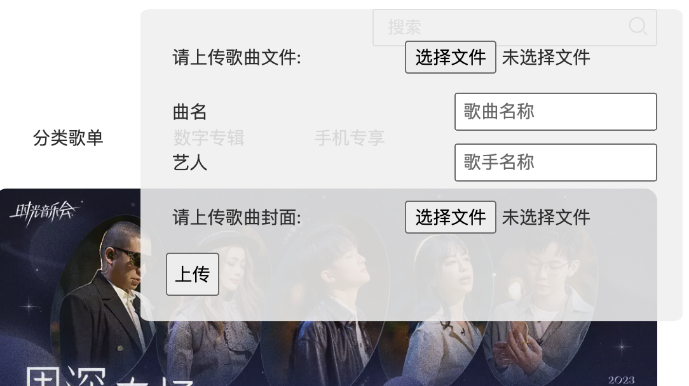
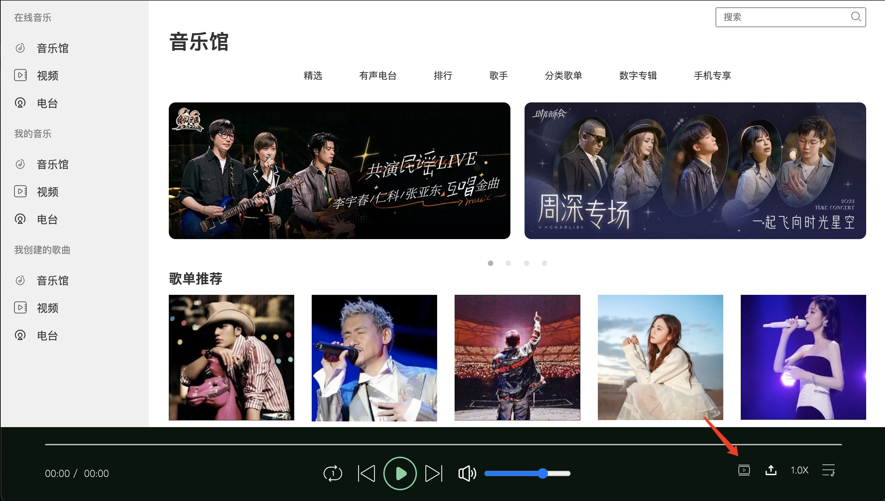
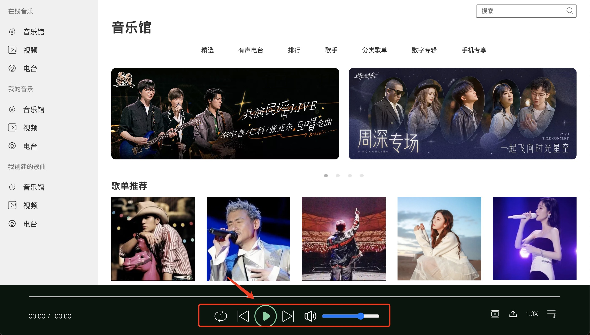
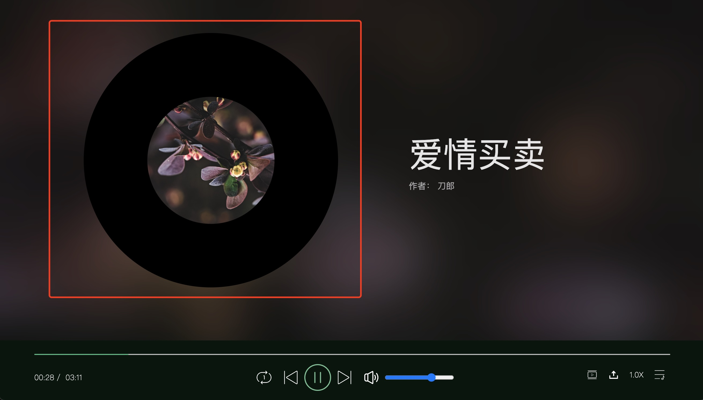

# JS-project

侯欣昀 敬鼎豪

## 一、项目描述

本次项目，我们二人以小组为单位做了一个JS软件项目。我们参考qq音乐的界面，开发了一个音乐网站。我们使用JS实现了网站主界面和播放界面的切换功能，并且实现了用户上传音乐文件并播放的功能。

## 二、项目展示


### 播放队列

用户可以通过点击播放队列来手动切换想听的歌曲。


点击右下角按钮可以切换、关闭播放队列。

点击空白处也可以关闭播放队列。


### 上传歌曲

初始播放队列为空，用户需要手动上传歌曲。

用户点击右下角按钮进行上传：


弹出信息窗口，两个file input元素各自限定了选择的文件格式必须为为音频和图片。



用户点击上传以后，程序会判断文件与封面是否已上传，否则拒绝提交。

上传成功后会自动播放新的歌曲，歌曲也会出现在播放队列里


> 示例音乐文件被存放在`/music`，示例专辑封面被存放在`/images`，默认队列中是没有文件的，需要手动上传

### 界面切换
用户可以通过点击界面切换的按钮来实现播放器和主页间的切换



点击之后播放器的界面会从下往上自然弹出，再次点击后界面会从上往下收回，回到主页的界面

### 播放控制按键（暂停、上下首、进度条）
下面脚栏中间是一些控制按键，可以实现歌曲的播放与暂停，上下首的切换等功能。



### 唱片旋转

注意到一般的音乐播放器中，都会让封面模拟唱片旋转的过程，这里我们也是一样，点击播放后，在播放界面，封面会以匀速顺时针旋转





## 三、实现过程


### 播放队列

播放列表的开关

```javascript
// 点击列表展开音乐列表
function openListBoard(event) {
    musicList.classList.remove("list-card-hide");
    musicList.classList.add("list-card-show");
    musicList.style.display = "flex";
    closeList.style.display = "flex";
    closeList.addEventListener('click', closeListBoard)
    list.removeEventListener('click', openListBoard)
    list.addEventListener('click', closeListBoard);
}

list.addEventListener('click', openListBoard);

// 点击关闭面板关闭音乐列表
function closeListBoard() {
    list.removeEventListener('click', closeListBoard);
    list.addEventListener('click', openListBoard);
    musicList.classList.remove("list-card-show");
    musicList.classList.add("list-card-hide");
    closeList.style.display = "none";
}
```

向文件上传功能提供的接口

```javascript
// 1. 填入播放列表，即添加div子元素
// 2. 完成事件绑定
function addToPlaylist(songId, songName = "unknown", artistName = "unknown"){
    l = document.createElement('div')
    l.setAttribute('id', `music${songId}`)
    l.innerText = songName + ' - ' + artistName
    document.getElementById("all-list").appendChild(l)
    // throw Error;
    document.getElementById(`music${songId}`).addEventListener('click', function (event) {
        musicId = songId;
        initAndPlay();
    }); 
    musicId = songId;
    initAndPlay();
}


// 添加新的乐曲到播放列表
function addSongFile(songFile, songName, artistName, backgroundImage){
    musicData.push({songFile, songName, artistName, backgroundImage});

    addToPlaylist(musicData.length - 1, songName, artistName);

    return musicData.length -1;
}
```

### 上传文件

文件信息全部存储在data这一array中

```javascript
let musicData = []; // {songFile, songName, artistName, backgroundImage}

// upload功能
upload.addEventListener('click', function (event) {
    // 切换表单的显示状态
    if (form.style.display === 'none') {
        form.reset();
        hint.innerHTML = "";
        form.style.display = 'flex';
    } else {
        form.style.display = 'none';
    }
});


// 监听表单的submit事件
form.addEventListener('submit', function(event) {
    // 阻止表单的默认提交行为
    event.preventDefault();

    // 获取用户输入的数据
    var songFile = document.getElementById('songFile').files[0];
    var songName = document.getElementById('songName').value;
    var artistName = document.getElementById('artistName').value;
    var backgroundImage = document.getElementById('backgroundImage').files[0];

    if(songFile === undefined || backgroundImage === undefined){
        hint.innerHTML = "歌曲文件或专辑封面文件为空！";
        return;
    } 
    if(songName === ""){songName = songFile.name.substring(0, songFile.name.lastIndexOf("."));}
    if(artistName === ""){artistName = "未知"}

    // 存储并将歌曲加入播放列表
    addSongFile(songFile, songName, artistName, backgroundImage);

    form.style.display = 'none';
});
```

在`initMusic`中使用`FileReader`对File对象进行读取，需要回传`audio.oncanplay`来保证音乐加载完毕，防止promise报错

```javascript

// 初始化音乐
function initMusic() {
    // audio.src = "mp3/music" + musicId.toString() + ".mp3";
    var reader = new FileReader(); // 创建一个 FileReader 对象

    reader.onload = function(e) {
        try {
            audio.src = e.target.result;
            audio.oncanplay = function() {
                audio.play(); // 当音频文件加载完成后，开始播放
            };
        } catch (error) {
            console.log("try", e);
        }
    };
    reader.readAsDataURL(musicData[musicId]["songFile"]); // 以 DataURL 格式读取文件
    audio.load();
    recordImg.classList.remove('rotate-play');
    audio.ondurationchange = function () {
        musicTitle.innerText = musicData[musicId]["songName"];
        author.innerText = musicData[musicId]["artistName"];

        var reader1 = new FileReader();
        reader1.onload = function(e){
            try {
                recordImg.style.backgroundImage = 'url(' + e.target.result + ')';
                bg.style.backgroundImage = 'url(' + e.target.result + ')';
            } catch (error) {
                console.log("try", e);
            }
        }
        reader1.readAsDataURL(musicData[musicId]["backgroundImage"])

        audioTime.innerText = transTime(audio.duration);
        // 重置进度条
        audio.currentTime = 0;
        updateProgress();
        refreshRotate();
    }
}

// 初始化并播放
function initAndPlay() {
    initMusic();
    pause.classList.remove('icon-play');
    pause.classList.add('icon-pause');
    try {
        // audio.play();
        rotateRecord();
    } catch (error) {
        console.log("try", e);
    }
}
```

### 切换界面
通过num变量记录所处界面，设置主页和播放界面的display属性来实现切换

```javascript
// 切换播放界面
var num = 0;

change.addEventListener('click', function (event) {
    if(num == 0)
    {
        container.style.display = "none";
        bg.classList.remove("recorder-hide");
        bg.classList.add("recorder-show");
        bg.style.display = "block";
        num = 1;
        document.body.style.overflow = "hidden";
        return;
    }
    else{
        bg.classList.remove("recorder-show");
        bg.classList.add("recorder-hide");
        setTimeout(function() {
            container.style.display = "block";
            bg.style.display = "none";
        }, 600);
        num = 0;
    }
});
```

用recorder-hide和recorder-show来实现丝滑的切换
```javascript
.recorder-show {
    animation: showAniY;
    animation-duration: 1s;
    animation-fill-mode: forwards;
    -webkit-animation-fill-mode: forwards;
}

.recorder-hide {
    animation: hideAniY;
    animation-duration: 1s;
    animation-fill-mode: forwards;
    -webkit-animation-fill-mode: forwards;
}
```

### 播放控制按键

这一部分主要是通过绑定按钮和对应的点击监听函数来实现的，

`暂停/播放键`：点击后设置audio的音乐播放，同时控制唱片的旋转（Rotate函数），最后再修改相关图标

```javascript
// 暂停/播放功能实现
pause.onclick = function (e) {
    if (audio.paused) {
        audio.play();
        rotateRecord();
        pause.classList.remove('icon-play');
        pause.classList.add('icon-pause');
    } else {
        audio.pause();
        rotateRecordStop();
        pause.classList.remove('icon-pause');
        pause.classList.add('icon-play');
    }
}
```

`上/下一首键`：点击后修改musicId，再重置音乐播放，调用初始化函数，实现上下首的切换

```javascript
// 上一首
skipForward.addEventListener('click', function (event) {
    musicId = musicId - 1;
    if (musicId < 0) {
        musicId = 3;
    }
    initAndPlay();
});

// 下一首
skipBackward.addEventListener('click', function (event) {
    musicId = musicId + 1;
    if (musicId > 3) {
        musicId = 0;
    }
    initAndPlay();
});
```
`音量调节键`：直接根据滑块对应的数值去调节音量，同时监听点击来设置静音

```javascript
// 存储上一次的音量
var lastVolumn = 70

// 滑块调节音量
audio.addEventListener('timeupdate', updateVolumn);
function updateVolumn() {
    audio.volume = volumeTogger.value / 70;
}

// 点击音量调节设置静音
volume.addEventListener('click', setNoVolumn);
function setNoVolumn() {
    if (volumeTogger.value == 0) {
        if (lastVolumn == 0) {
            lastVolumn = 70;
        }
        volumeTogger.value = lastVolumn;
        volume.style.backgroundImage = "url('img/音量.png')";
    }
    else {
        lastVolumn = volumeTogger.value;
        volumeTogger.value = 0;
        volume.style.backgroundImage = "url('img/静音.png')";
    }
}
```

`播放模式的设置`：监听鼠标点击来设置图标切换，同时设置audio.onended来实现不同的播放设置（循环/随机/下一首）

```javascript
// 播放模式设置
var modeId = 1;
mode.addEventListener('click', function (event) {
    modeId = modeId + 1;
    if (modeId > 3) {
        modeId = 1;
    }
    mode.style.backgroundImage = "url('img/mode" + modeId.toString() + ".png')";
});

audio.onended = function () {
    if (modeId == 2) {
        // 跳转至下一首歌
        musicId = (musicId + 1) % 4;
    }
    else if (modeId == 3) {
        // 随机生成下一首歌的序号
        var oldId = musicId;
        while (true) {
            musicId = Math.floor(Math.random() * 3) + 0;
            if (musicId != oldId) { break; }
        }
    }
    initAndPlay();
}
```

`进度条`：更新进度条需要监听audio，根据音频播放时间绑定一个修改进度条的函数

```javascript
// 更新进度条
audio.addEventListener('timeupdate', updateProgress); // 监听音频播放时间并更新进度条
function updateProgress() {
    var value = audio.currentTime / audio.duration;
    progress.style.width = value * 100 + '%';
    playedTime.innerText = transTime(audio.currentTime);
}
```
同时也需要监听进度条上的鼠标点击事件，调整audio的播放进度
```javascript
// 点击进度条跳到指定点播放
progressTotal.addEventListener('mousedown', function (event) {
    // 只有音乐开始播放后才可以调节，已经播放过但暂停了的也可以
    if (!audio.paused || audio.currentTime != 0) {
        var pgsWidth = parseFloat(window.getComputedStyle(progressTotal, null).width.replace('px', ''));
        var rate = event.offsetX / pgsWidth;
        audio.currentTime = audio.duration * rate;
        updateProgress(audio);
    }
});
```

### 唱片旋转效果
以下是几个rotate相关的函数，通过这几个函数可以控制唱片的旋转与暂停，一般在初始化播放或者切换歌曲的时候会调用
```javascript
// 刷新唱片旋转角度
function refreshRotate() {
    recordImg.classList.add('rotate-play');
}

// 使唱片旋转
function rotateRecord() {
    recordImg.style.animationPlayState = "running"
}

// 停止唱片旋转
function rotateRecordStop() {
    recordImg.style.animationPlayState = "paused"
}
```
旋转的动画是通过下面css相关代码设置的
```javascript
keyframes rotateAni {
    from {
        transform: rotate(0deg);
    }

    to {
        transform: rotate(360deg);
    }
}

.rotate-play {
    animation: rotateAni 10s infinite linear;
    animation-play-state: paused;
    animation-fill-mode: forwards;
    -webkit-animation-fill-mode: forwards;
}
```

## 四、总结


通过这个大作业，我们在实践的过程中充分学习了Javascript+HTML+css的相关知识，尝试模仿制作了一个音乐类的播放网站，虽然在效果上不能与完善的APP相媲美，但是也成功实现了一些关键性的功能。我们也认识到了制作一个功能齐全、页面精美的网站对于组织代码的高要求，希望在后续的学习中日渐提升代码能力，学习并掌握更多javascript地相关知识。


## 五、附录

